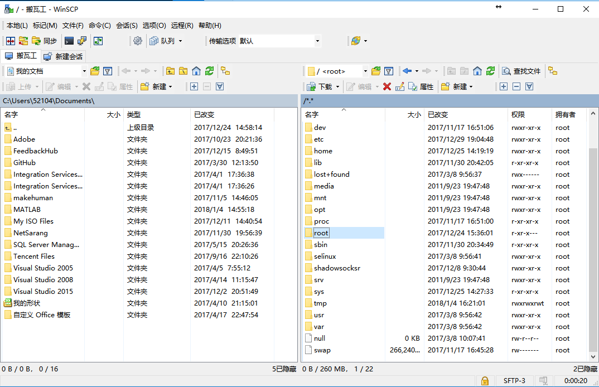

### [返回首页](../README.md)

winscp 可以方便的在 windows 和 linux 直接传输文件。

#Features

- Graphical user interface (screenshots)
- Translated into many languages
- Integration with Windows (drag&drop, URL, shortcut icons, jump list)
- All common operations with files
- Support for SFTP and SCP protocols over SSH and FTP and WebDAV and S3 protocols
- Batch file scripting and command-line interface and .NET assembly for advanced programming tasks
- Directory synchronization in several semi or fully automatic ways
- Integrated text editor
- Shares site settings with PuTTY
- Support for password, keyboard-interactive, public key and Kerberos (GSS) authentication
- Integrates with Pageant (PuTTY authentication agent) for full support of public key authentication with SSH
- Explorer and Commander interfaces
- Optionally protects stored site information with master password
- Optionally supports portable operation using a configuration file in place of registry entries, suitable for operation from removable media

# Reference
- [download](https://winscp.net/eng/download.php)

### [返回首页](../README.md)
